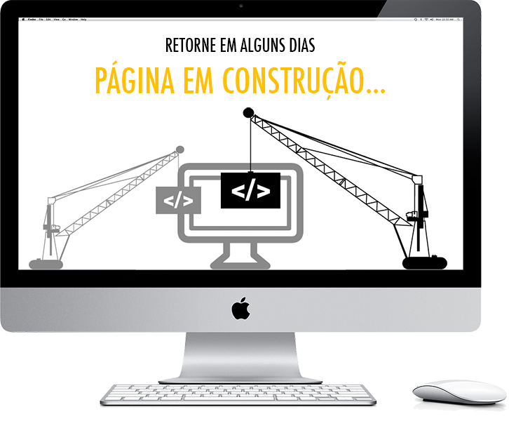

<!---->

# Um pouco sobre mim!

Trabalho a 3,5 anos como analista/desenvolvedor VBA.

Estou em processo de evolução, focando o ano 2021/2022 em estudo para uma futura migração para desenvolvimento WEB.

Formado em redes de Computadores na Universidade Uniderp, atualmente estou cursando análise e desenvolvimento de sistemas na UFMS.

## Hard Skills

### Cursos recentes concluidos!

:white_check_mark: Programação Orientada a Objetos utilizando a linguagem C#

https://www.udemy.com/share/103qC43@rgaqqGvUyzJgkHPKprUG4PeaAWtNJpz9bl3lOjaxEoIccsHpJottiy-n9yEvZnR0/

duração: 17 horas

:white_check_mark: Programação em Python do básico ao avançado. 

https://www.udemy.com/share/101sI62@Pm5gVGFfQlMHdU9CBmJNfT1tSn0=/

duração: 63,5 horas

:white_check_mark: Produtividade com VSCode. 

https://www.udemy.com/share/101sTY2@FEdgVEtfQlMHdU9CBkhNfRRt/

duração: 2 horas

 

:white_check_mark: Testes de aplicações modernas com Cypress.

https://www.udemy.com/share/102lok2@FG5jfUtjWlAGdU9EC3JzfT1HSn1LYw==/ 

duração: 14 horas

### Cursos em andamentos!

:white_square_button: Curso de idioma!(inglês) no Instituto Brasileiro de Línguas.

https://www.ibl-idiomas.com.br/#/

:white_square_button: C# COMPLETO Programação Orientada a Objetos + Projetos

https://www.udemy.com/share/101Wjk3@IlqTC57DZzGlGFfdkv2J-6KeU0qnKAKOvod-z7ZPAPJRqF_wOvtyCYFMH9ZftZOU/

duração: 37 horas

:white_square_button: Curso Angular, .net Core Web API e Angular Material. 

https://www.udemy.com/share/104rQi2@PW5KVEtfQlMHdU9CBkhNVD0=/

duração: 18,5 horas

:white_square_button: Curso Web Moderno Completo com JavaScript 2021 + Projetos. 

https://www.udemy.com/share/101qTY2@PW1jfV5STFwIekZGEktnfj4=/

duração: 89,5 horas

## Soft Skills

Dedicado,

Responsável, 

Comunicativo,

Organizado.

<!--

**jefersonlima/jefersonlima** is a ✨ _special_ ✨ repository because its `README.md` (this file) appears on your GitHub profile.

Here are some ideas to get you started:

- 🔭 I’m currently working on ...
- 🌱 I’m currently learning ...
- 👯 I’m looking to collaborate on ...
- 🤔 I’m looking for help with ...
- 💬 Ask me about ...
- 📫 How to reach me: ...
- 😄 Pronouns: ...
- ⚡ Fun fact: ...
-->
